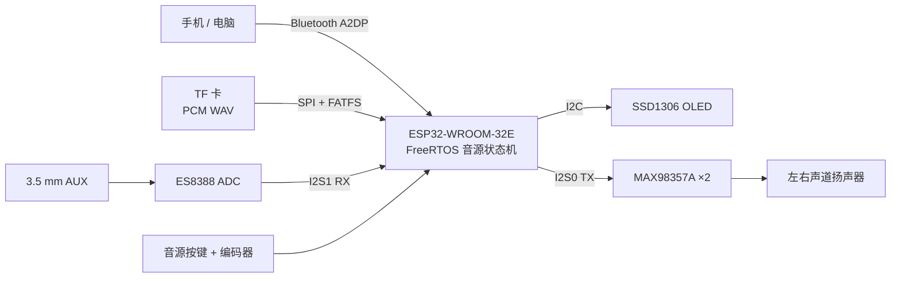

# ESP32 多音源蓝牙音箱

一款基于 **ESP32-WROOM-32E + ESP-IDF** 的桌面立体声音箱工程样机。项目覆盖原理图与 PCB、FreeRTOS 固件、Bluetooth A2DP、TF 卡本地播放、AUX 音频采集、I2S 数字功放和人机交互，目标是完整展示嵌入式软硬件协同开发能力。

> 当前状态：固件已完成 Bluetooth / TF / AUX 三种模式及自动化测试，并通过 ESP-IDF 5.4 完整编译；实物联调和演示素材仍需在板卡上补充验证。

## 项目亮点

- 基于 ESP-IDF Classic Bluetooth 实现 A2DP Sink，将手机或电脑的 PCM 音频送入 I2S 功放链路。
- 使用 FreeRTOS 任务管理 TF 和 AUX 播放，切换音源时完成任务停止、外设释放与采样率恢复。
- TF 模式解析 RIFF/WAVE 数据块，支持 16-bit PCM、单/双声道、8–48 kHz，并自动循环播放。
- AUX 模式通过 ES8388 ADC 与 I2S1 连续采集，再由 I2S0 输出至双 MAX98357A。
- 使用旋转编码器调节数字音量，独立按键循环切换 `Bluetooth → TF → AUX`，OLED 同步显示音源和音量。
- 自主完成 2 层 PCB、电源树、音频链路、接口分配、BOM、Gerber 与固件测试设计。

## 功能状态

| 功能 | 实现状态 | 说明 |
|---|---|---|
| Bluetooth A2DP | 已实现，待实物复验 | 默认音源，设备名为 `BT Speaker` |
| TF 卡播放 | 已实现，待实物复验 | 播放根目录 `/MUSIC.WAV`，结束后循环 |
| AUX 播放 | 已实现，待实物复验 | ES8388 采集，I2S 转发至数字功放 |
| 音源切换 | 已实现 | Bluetooth / TF / AUX 循环切换 |
| 音量控制 | 已实现 | 旋转编码器，范围 0–50 |
| OLED 显示 | 已实现 | 显示当前模式与音量 |
| 自动化测试 | 39 项通过 | Python `unittest` 源码契约测试 |
| ESP-IDF 编译 | 已通过 | ESP-IDF 5.4，ESP32 target |

当前固件不包含 U 盘播放，也不包含 MP3 解码。PCB 中保留了早期原型的 CH376S 相关硬件和 SPI 隔离处理，但它不参与当前播放状态机。

## 系统架构



音源切换流程：

```text
Bluetooth A2DP → TF/WAV → AUX → Bluetooth A2DP
```

## 主要硬件

| 模块 | 主要器件 | 用途 |
|---|---|---|
| 主控与无线 | ESP32-WROOM-32E | Bluetooth A2DP、FreeRTOS 状态机及外设控制 |
| AUX Codec | ES8388 | 模拟 AUX 转 I2S PCM |
| 数字功放 | MAX98357A ×2 | I2S 左右声道功率输出 |
| 本地存储 | TF/SD 卡座 | SPI + FATFS 读取 WAV 文件 |
| 显示 | SSD1306 128×64 OLED | 显示音源与音量 |
| 输入 | 旋转编码器、音源按键 | 音量调节与模式切换 |
| 电源 | IP5306、SY8088IAAC | 1S 锂电池充放电、5 V/3.3 V 电源 |
| 扬声器 | 4 Ω 5 W ×2 | 2.0 声道输出 |

详细设计资料见 [`方案/`](方案/)；硬件源工程、BOM 和 Gerber 文件见 [`hardware/`](hardware/)。

## 软件结构

```text
software/
├── main/                 # 应用入口与音源状态机
├── bsp/include/          # BSP 对外接口
├── bsp/src/              # 蓝牙、TF、AUX、音量、OLED 等驱动
├── tests/                # Python 源码契约测试
├── partitions.csv        # 自定义分区表
└── sdkconfig.defaults    # ESP-IDF 默认配置
```

关键模块：

- `bsp_bluetooth.c`：Bluetooth A2DP Sink、采样率配置与 PCM 输出。
- `bsp_tf_player.c`：TF 挂载、WAV 头解析、单声道转双声道与循环播放。
- `bsp_aux.c`：ES8388 初始化、I2S1 采集及 I2S0 输出。
- `bsp_speaker.c`：I2S 数字功放、采样率和数字音量处理。
- `bsp_mode.c`：三种音源的顺序切换。

## 开发环境

- ESP-IDF 5.4
- CMake + Ninja
- Python 3.11（运行测试）
- Target：ESP32

## 编译与烧录

先安装并激活 ESP-IDF 5.4 环境：

```bash
cd software
idf.py set-target esp32
idf.py build
idf.py -p <SERIAL_PORT> flash monitor
```

Windows 示例：

```powershell
cd software
idf.py -p COM5 flash monitor
```

串口号需替换为开发板实际端口。第一次执行 `set-target` 可能重新生成 `sdkconfig`，该文件属于本地构建配置，不提交到仓库。

## TF 卡音乐准备

1. 将 TF 卡格式化为 FAT32。
2. 准备 PCM WAV 文件：16-bit、单声道或双声道、8–48 kHz。
3. 将文件命名为 `MUSIC.WAV`，放到 TF 卡根目录。
4. 插卡后通过音源按键切换到 `TF` 模式。

例如使用 FFmpeg 转换：

```bash
ffmpeg -i input.mp3 -ar 44100 -ac 2 -c:a pcm_s16le MUSIC.WAV
```

## 自动化测试

在仓库根目录执行：

```bash
python -m unittest discover -s software/tests -v
```

测试覆盖音源状态机、Bluetooth A2DP、TF WAV 播放、AUX 连续播放、I2S 功放、OLED、分区配置和组件构建清单。

## 实物演示

仓库目前没有可公开的实物演示素材。完成板卡复验后，建议补充以下内容：

- `docs/images/prototype.jpg`：PCB 与整机照片。
- `docs/images/architecture.jpg`：实物接口标注图。
- 30–60 秒演示视频：依次展示蓝牙、TF、AUX 切换和音量调节，并把链接放在本节。

## 项目资料

- [项目方案与设计记录](方案/README.md)
- [硬件工程、BOM 与 Gerber](hardware/)
- [软件源码](software/)
- [自动化测试](software/tests/)

## 说明

该仓库用于个人学习、工程实践和求职作品展示。README 中的“已实现”表示源码功能及构建验证已经完成；实际音质、续航、温升和长时间稳定性仍以实体样机测试结果为准。
