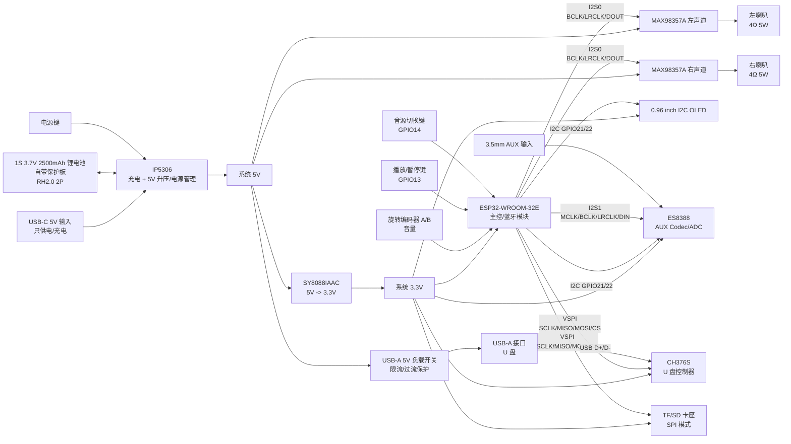

# 原理图检查清单与系统框图

更新日期：2026-07-09

## 1. 首版设计边界

这份文档用于画首版原理图前自查。目标不是一次把所有功能做满，而是保证首版裸板可以稳定启动、可以播放、可以调试，并且能体现“非模块化自研”的工程含量。

已确认的首版边界：

- 主控：ESP32-WROOM-32E 模块。
- 外部 Flash/晶振/RF：首版使用模块内部集成部分，不单独画外部 Flash、40MHz 晶振和 RF 匹配。
- 不加 PSRAM。
- 音频输出：MAX98357A x2，立体声 2.0，驱动 4Ω 5W 喇叭 x2。
- AUX 输入：ES8388 做 Codec/ADC，只做输入，不做耳机输出。
- 本地存储：TF/SD 卡 SPI + CH376S 裸芯片接 U 盘。
- 显示：0.96 英寸 I2C OLED，SSD1306 类。
- 电源：USB-C 5V 输入 + IP5306 + 1S 3.7V 2500mAh 锂电池。
- 3.3V：SY8088IAAC 从系统 5V 降压。
- USB-C：只供电和充电，不走数据。
- USB-A：只接 U 盘，不做电脑声卡。
- UI：一个旋转编码器控制音量，独立播放/暂停键，独立音源切换键，IP5306 独立电源按键。
- PCB：首版 2 层板，优先可调试和可返修。

## 2. 系统框图

## 3. 原理图页建议

建议原理图按下面页签拆分，后期检查会清楚很多：

1. 电源输入、电池、IP5306、系统 5V。
2. 3.3V 电源、SY8088IAAC、各电源测试点。
3. ESP32-WROOM-32E、EN/BOOT、下载电路、启动绑带脚、模块天线净空。
4. I2S 功放：MAX98357A x2、喇叭接口、静音控制。
5. AUX 输入：3.5mm 输入座、ES8388、模拟滤波。
6. U 盘与 TF/SD：CH376S、USB-A、TF/SD 卡座、SPI 总线。
7. OLED、按键、旋转编码器、测试点。
8. 连接器、安装孔、调试接口、预留焊盘。

## 4. 电源检查清单

### 4.1 USB-C 5V 输入

- USB-C 只做 5V 供电，不接 USB2.0 数据到 ESP32。
- CC1、CC2 需要按 5V Sink 方式接下拉电阻。
- VBUS 后面加输入保护：保险丝或限流器件、TVS、输入电容。
- USB-C 外壳和系统 GND 的连接方式要明确，预留 ESD 泄放路径。
- 标注最大输入电流目标，首版不要假设所有充电器都能给大电流。

### 4.2 IP5306 与电池

- BAT 接 1S 锂电池，接口为 RH2.0 2P，丝印标清正负极。
- 电池自带保护板，但板上仍要避免反接和短路风险。
- IP5306 的 VIN、BAT、SW、VOUT、电感、输入/输出电容和其他外围件必须按所采购 IP5306 datasheet 的典型应用图连接；不要只凭简化电源树自行改接。
- IP5306 KEY 接独立实体按键，不接 ESP32。
- IP5306 LED/状态脚首版预留测试点，不做复杂联动。
- IP5306 输出作为系统 5V，给功放、USB-A 负载开关和 3.3V Buck。
- 给 IP5306 的大电流路径加宽线，电感、电容靠近芯片。

### 4.3 系统 5V

- 系统 5V 至少分三路标注：功放 5V、USB-A 5V、3.3V Buck 输入。
- MAX98357A 和 USB-A 的 5V 供电要各自就近放去耦电容。
- USB-A 5V 必须经过限流/过流保护负载开关，不直接从系统 5V 硬连。
- 首版 USB-A 负载开关 EN 可默认随系统 5V 使能，OC 预留测试点。
- 系统 5V 预留测试点，方便测启动、电流和纹波。

### 4.4 SY8088IAAC 3.3V

- SY8088IAAC 输入接系统 5V，输出系统 3.3V。
- 电感、输入电容、输出电容、反馈电阻按数据手册推荐布局。
- 3.3V 给 ESP32-WROOM-32E、ES8388 数字侧、OLED、CH376S 逻辑侧、TF/SD。
- 3.3V 预留测试点。
- ESP32-WROOM-32E、ES8388、CH376S、OLED、TF/SD 每个芯片/接口旁边都要有就近 0.1uF 去耦；WROOM 模块 3.3V 输入旁建议再放 10uF 储能电容。
- 3.3V 电源能力要覆盖 ESP32 Wi-Fi/蓝牙峰值电流和外围芯片电流。

### 4.5 电池电压检测

- BAT_ADC 使用 GPIO36。
- 电池分压电阻阻值不要太小，避免待机耗电过高。
- ADC 输入处加小电容滤波。
- 分压后的最大电压必须小于 ESP32 ADC 允许输入范围。
- 分压节点预留测试点。

## 5. ESP32 最小系统检查清单

### 5.1 ESP32-WROOM-32E 模块

- ESP32-WROOM-32E 3V3 接系统 3.3V，GND 全部接地。
- 模块 3V3 旁放 0.1uF + 10uF 去耦/储能电容。
- 模块内部已集成 Flash、晶振、RF 匹配和天线，首版不再外接这些器件。
- 模块天线端必须放在 PCB 板边，天线 keepout 区不铺铜、不走线、不放器件。
- 模块下方按 datasheet 要求处理铜皮和过孔，不要让大电流线穿过模块天线区域。
- GPIO6-GPIO11 不作为外设 GPIO 使用。

### 5.2 EN、BOOT、下载和调试

- EN 按官方参考电路做上拉、RC 复位和复位按键。
- GPIO0 只用于 BOOT/下载按键，不接普通外设。
- UART0 TXD/RXD 使用 GPIO1/GPIO3，预留下载调试接口。
- 下载接口至少引出 3.3V、GND、TXD、RXD、EN、GPIO0。
- 首版建议同时保留自动下载电路焊盘和手动下载按键方案。

### 5.3 启动绑带脚

- GPIO0：只做 BOOT。
- GPIO2/GPIO4/GPIO12：首版不接普通功能，或只预留测试点。
- GPIO5：TF/SD CS，默认必须为高电平/非选中。
- GPIO15：CH376S CS，默认必须为高电平/非选中。
- GPIO5/GPIO15 不能接人工按键，避免上电时被按住影响启动。
- GPIO5/GPIO15 的上拉/下拉必须按 ESP32 硬件设计指南复核。

## 6. 音频输出检查清单

### 6.1 I2S0 到双 MAX98357A

- I2S0 BCLK：GPIO26。
- I2S0 LRCLK：GPIO25。
- I2S0 DOUT：GPIO27。
- AMP_SD/MUTE：GPIO16。
- 两颗 MAX98357A 共用 BCLK、LRCLK、DIN。
- 左右声道通过 MAX98357A 的 L/R 配置脚区分。
- 每颗 MAX98357A 的 SD/MUTE 连接策略要明确，可共用 GPIO16 控制。
- MAX98357A 供电接系统 5V，就近放 0.1uF 和较大电容。

### 6.2 喇叭接口

- 两个喇叭接口标注 L+/L-、R+/R-。
- 喇叭为 4Ω 5W x2，但首版不要承诺长期满功率输出。
- 喇叭线和功放输出走线要远离 ESP32-WROOM-32E 模块天线、ES8388 模拟输入和 USB 数据线。
- 功放输出不要当普通单端音频线处理，按差分大电流开关输出走线。
- 喇叭接口旁预留足够焊盘强度。

## 7. AUX 输入与 ES8388 检查清单

### 7.1 ES8388 数字接口

- ES8388 I2C 控制接 GPIO21/GPIO22。
- ES8388 I2S1 MCLK：GPIO33。
- ES8388 I2S1 BCLK：GPIO32。
- ES8388 I2S1 LRCLK：GPIO17。
- ES8388 ADC 数据到 ESP32 DIN：GPIO35。
- ES8388 作为 I2S slave，ESP32 作为 I2S master。
- I2S1 只负责 AUX 输入采集，和 I2S0 功放输出分开。

### 7.2 ES8388 供电和模拟输入

- ES8388 的数字电源、模拟电源、参考电压脚按数据手册推荐去耦。
- 模拟输入从 3.5mm AUX 座进入 ES8388 line-in 推荐电路。
- AUX 输入处预留 ESD 保护。
- AUX 左右声道走线尽量短，远离 IP5306、SY8088 电感、MAX98357A 输出、USB-A。
- 模拟地处理要谨慎，首版 2 层板优先保证底层 GND 连续，不随意割地。
- AUX 输入座外壳接地方式要明确，避免插拔噪声和静电问题。

## 8. U 盘与 TF/SD 检查清单

### 8.1 VSPI 共用总线

- VSPI SCLK：GPIO18。
- VSPI MISO：GPIO19。
- VSPI MOSI：GPIO23。
- TF/SD CS：GPIO5。
- CH376S CS：GPIO15。
- TF/SD 和 CH376S 共用 SCLK/MISO/MOSI，但同一时刻只能选中一个 CS。
- 两个 CS 默认都要高电平，保证上电时外设不被误选中。
- SPI 总线上预留串联电阻焊盘，首版调试信号完整性时有余地。

### 8.2 CH376S 与 USB-A

- CH376S 使用裸芯片，不用模块。
- CH376S 的供电、电容、晶振/时钟按数据手册连接。
- CH376S 与 ESP32 使用 SPI，不使用 UART 方案。
- CH376S INT 首版不接 ESP32，预留测试点，软件轮询状态。
- USB-A D+/D- 从接口到 CH376S 走线短、并行、少过孔。
- USB-A D+/D- 加 ESD 保护。
- USB-A 5V 从系统 5V 经负载开关输出，不能直接硬连。
- USB-A 外壳接地方式明确。

### 8.3 TF/SD 卡座

- TF/SD 使用 SPI 模式，不使用 SDIO。
- TF/SD 供电 3.3V，靠近卡座放去耦电容。
- TF/SD CD 首版不接 ESP32，预留测试点。
- 卡座金属壳接地。
- TF/SD 走线远离功放输出和电源开关节点。

## 9. OLED 与 UI 检查清单

### 9.1 OLED

- OLED 使用 I2C，接 GPIO21/GPIO22。
- OLED 供电优先选 3.3V 版本。
- SDA/SCL 上拉到 3.3V。
- I2C 总线上 OLED 和 ES8388 共用，地址不能冲突。
- OLED 接口标注 VCC、GND、SCL、SDA。

### 9.2 旋转编码器和按键

- 旋转编码器 A：GPIO34。
- 旋转编码器 B：GPIO39。
- GPIO34/GPIO39 没有内部上拉，必须外接上拉电阻。
- 编码器 A/B 建议加 RC 或软件消抖，原理图可预留小电容焊盘。
- 播放/暂停：GPIO13，按下接 GND，外接上拉。
- 音源切换：GPIO14，按下接 GND，外接上拉。
- 播放/暂停和音源切换不使用启动绑带脚。
- IP5306 电源键独立接 IP5306 KEY，不接 ESP32。

## 10. 测试点与可调试性检查清单

首版裸板要多放测试点，尤其是你这个项目要用于简历展示，调试过程本身也是工程能力的一部分。

必须预留：

- GND 测试点，至少 3 个。
- 系统 5V 测试点。
- 系统 3.3V 测试点。
- 电池 BAT+ 测试点。
- IP5306 KEY、状态脚测试点。
- ESP32 EN、GPIO0、TXD、RXD 测试点或下载排针。
- I2C SDA/SCL 测试点。
- I2S0 BCLK/LRCLK/DOUT 测试点。
- I2S1 MCLK/BCLK/LRCLK/DIN 测试点。
- VSPI SCLK/MISO/MOSI、TF_CS、CH376S_CS 测试点。
- CH376S INT 测试点。
- USB-A 5V、D+、D- 测试点。
- AUX_L、AUX_R 输入测试点。

## 11. 2 层 PCB 前检查清单

画完原理图、开始 PCB 前必须检查：

- 底层是否能尽量保持连续 GND。
- ESP32-WROOM-32E 模块天线区域是否有明确净空。
- ESP32-WROOM-32E 是否放在板边，天线前方是否避开铜皮、线材、喇叭磁钢和金属外壳。
- IP5306、SY8088、电感、大电流电容是否能形成短回路。
- MAX98357A 是否靠近喇叭接口。
- 喇叭输出是否远离 AUX、模块天线和 USB 数据线。
- ES8388 和 AUX 输入是否能放在相对安静的模拟区域。
- USB-A 到 CH376S 的 D+/D- 是否能短而顺。
- TF/SD 卡座位置是否方便插拔，且 SPI 线不绕远路。
- OLED 和按键接口是否方便外壳开孔。
- 所有连接器正负极、方向、丝印是否明确。
- 是否给返修留出焊接空间。

## 12. 首次上电检查顺序

原理图设计时就要服务于这个上电顺序：

1. 不焊 ESP32、ES8388、CH376S、MAX98357A，先测 USB-C 输入和 IP5306。
2. 接电池，验证充电、升压、KEY 开关、系统 5V。
3. 焊 SY8088，验证 3.3V 空载和带载纹波。
4. 焊 ESP32-WROOM-32E，验证下载和启动日志。
5. 验证 OLED I2C。
6. 验证 I2S0 输出测试音到 MAX98357A。
7. 验证 TF/SD SPI 读卡。
8. 验证 CH376S 识别 U 盘。
9. 验证 ES8388 AUX 输入采集。
10. 最后做蓝牙播放、TF/U盘播放、AUX 输入之间的音源切换。

## 13. 原理图完成前的硬性问题

下面这些问题没有确认前，不建议直接下单打板：

1. ESP32-WROOM-32E 模块封装、天线 keepout、板边位置和外壳/喇叭避让。
2. IP5306 具体封装和外围参考电路版本。
3. SY8088IAAC 电感、电容、反馈电阻具体型号。
4. ES8388 封装、供电分区、line-in 推荐电路。
5. CH376S 裸芯片封装、供电电压和晶振要求。
6. USB-A 5V 负载开关具体型号。
7. MAX98357A 裸芯片封装、L/R 配置脚连接方式。
8. GPIO5/GPIO15 作为 CS 时的默认上拉和 ESP32 启动绑带电平复核。
9. 2 层板尺寸是否愿意放大，以换取更好的 GND 连续性和调试空间。
